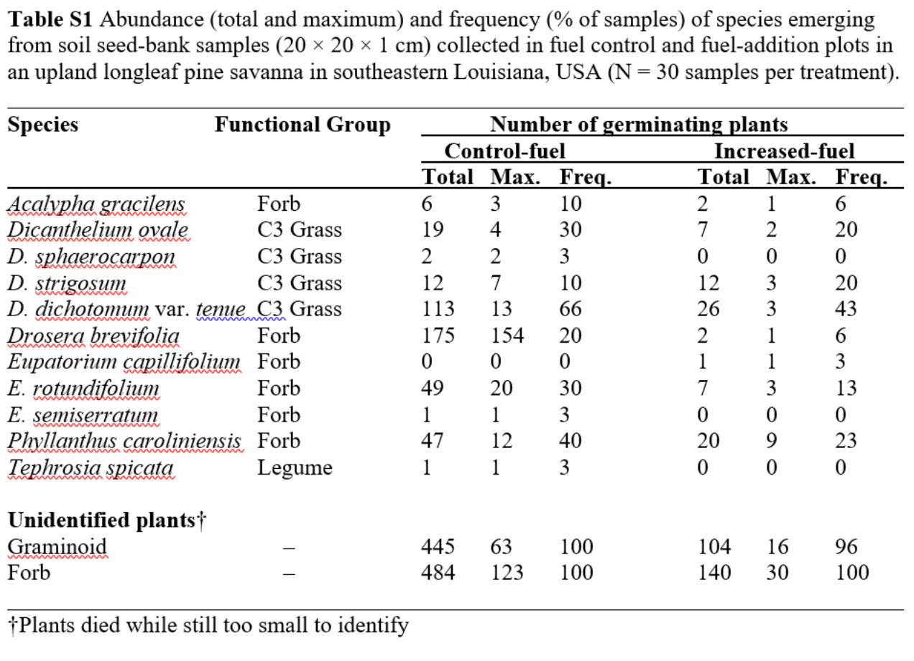
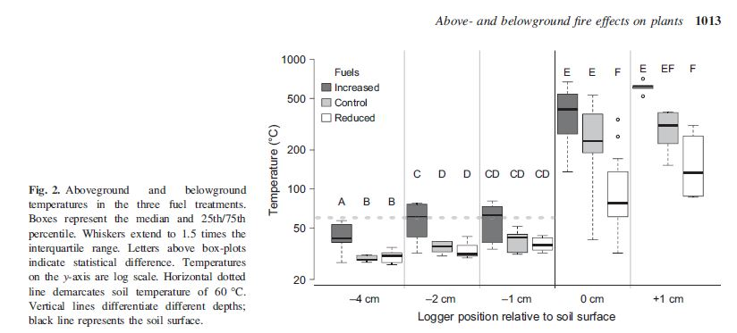
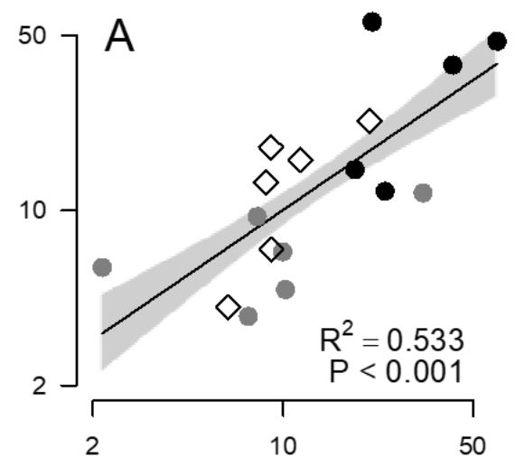
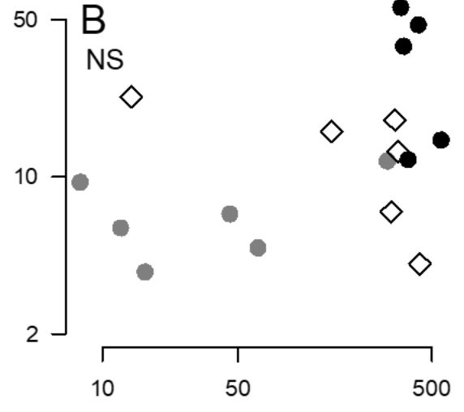
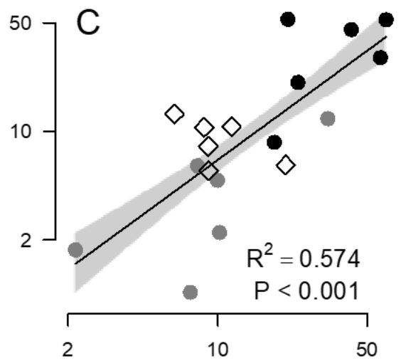
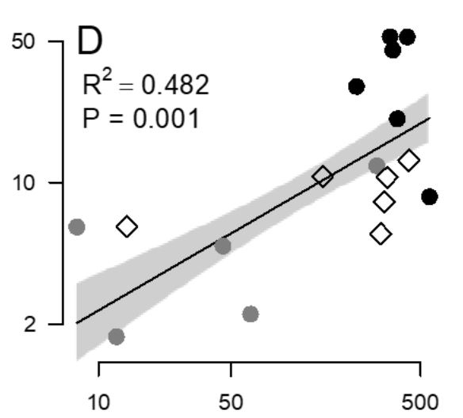
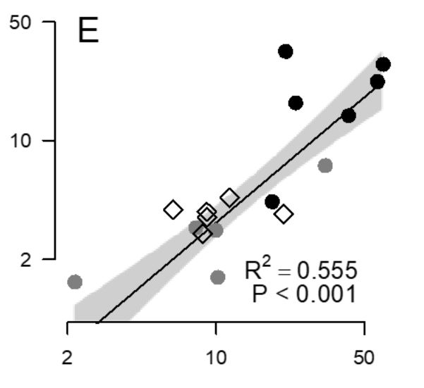
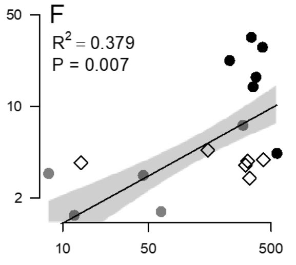

##  INTRODUCTION

The data I am working with is from a paper called *"Fuels and fires influence vegetation via above and belowground pathways in a high-diversity plant community"*.  See bottom of this document for complete citation.

The goal of the study was to investigate the effect of soil heating from fire on vegetation in a southeastern Longleaf Pine savanna, a naturally pyrogenic and high-diversity system. The investigators placed high-resolution thermocouples in vertical profile above and belowground, and manipulated fine fuel biomass loading.  They measured vegetation response both in the seedbank as well as in standing live vegetation following treatment.  Fire duration impacted soil heating and vegetation response, whereas fire temperature did not impact vegetation response.  This study analyzed data from these field experiments with structural equation modeling.  I chose this study because it leverages a variety of statistical analyses as inputs towards the structural equation model.  For descriptive statistics, I have chosen to replicate Table S1, which describes the abundance and frequency of species emerging from soil seed bank samples.  For visualization, I have chosen to replicate Figure 2, which is a boxplot of aboveground and belowground temperatures in the three fuel treatments.  For inferential statistics, I replicated Figure S1, which is a series of bivariate regressions comparing soil heating with fire duration and surface temperature increase, and also provided more detailed summaries of these regressions.

```{r}
library(tidyverse)
library(forcats)
library(ggpmisc)
library(broom)
library(knitr)
```

Read in fire loggers data
```{r}
f <- "https://raw.githubusercontent.com/DevinGrobert/ada_dgrobert_analysis_replication/main/FireLoggersCombinedData_DRYAD.csv"
fl <- read_csv(f, col_types = NULL, col_names=TRUE)
```

Read in seed bank data
```{r}
s <- "https://raw.githubusercontent.com/DevinGrobert/ada_dgrobert_analysis_replication/main/SeedBankProjectData_Dryad.csv"
sb <- read_csv(s, col_types = NULL, col_names=TRUE)
```

##  DESCRIPTIVE STATISTICS: replicate Table S1

Replace null values in species with functional group
```{r}
sb<-sb%>%mutate(Species = replace(Species, Species == "NULL", FunctionalGroup[Species=="NULL"]))
```

Replace grass with graminoid in place of missing grass species
```{r}
sb<-sb%>%mutate(Species = replace(Species, Species == "Grass", "Graminoid"))
```

Group by species and treatment
```{r}
by_sp_tr<-group_by(sb, Species, Treatment)
```

Create variables for total, max, and frequency.  freq is presence or absence as % of total plots (30 each trt type).  this took quite a bit of guess work to realize
```{r}
table_s1<- summarise(
  by_sp_tr,
  Total=sum(Individuals),
  Max=max(Individuals),
  Freq=sum(Unique)/30*100
   )
```

Round down to the nearest integer
```{r}
table_s1$Freq<-floor(table_s1$Freq)
```

Separate out controls and treatments, change variable names so they can be rejoined
```{r}
controls<-filter(table_s1, Treatment == "fuel control")
colnames(controls)<-paste("control_fuel", colnames(controls), sep="_")
controls$Species<-controls$control_fuel_Species
controls$control_fuel_Treatment=NULL
controls$control_fuel_Species<-NULL

treats<-filter(table_s1, Treatment == "fuel addition")
colnames(treats)<-paste("increased_fuel", colnames(treats), sep="_")
treats$Species<-treats$increased_fuel_Species
treats$increased_fuel_Treatment=NULL
treats$increased_fuel_Species<-NULL
```

Rejoin controls and treatments into a single table
```{r}
table_s1<-full_join(controls, treats, by = "Species")
```

Add back functional groups
```{r}
by_sp<-group_by(sb, Species)
sb_fg<-summarize(
  by_sp,
  FunctionalGroup = FunctionalGroup)
sb_fg<-unique(sb_fg)

table_s1<-full_join(table_s1, sb_fg, by="Species")
```

Delete oddball row for sp "graminoid" fg "grass" (redundant with sp "graminoid" fg "graminoid")
```{r}
table_s1<-table_s1[-c(11),]
```

Reorder columns
```{r}
table_s1<-table_s1[c(4,8,1,2,3,5,6,7)]
```

Reorder rows
```{r}
table_s1<-table_s1[order(table_s1$Species),]
table_s1<-table_s1[c(1,3:5,2,6:9,12,13,11,10),]
```

Replace NA with 0
```{r}
table_s1[is.na(table_s1)]<-0
```

Change column names so they are narrower, to improve the display.
```{r}
table_s1$Sp<-table_s1$Species
table_s1$FunG<-table_s1$FunctionalGroup
table_s1$ctrlTot<-table_s1$control_fuel_Total
table_s1$ctrlMax<-table_s1$control_fuel_Max
table_s1$ctrlFreq<-table_s1$control_fuel_Freq
table_s1$IncrTot<-table_s1$increased_fuel_Total
table_s1$IncrMax<-table_s1$increased_fuel_Max
table_s1$IncrFreq<-table_s1$increased_fuel_Freq

table_s1$Species<-NULL
table_s1$FunctionalGroup<-NULL
table_s1$control_fuel_Total<-NULL
table_s1$control_fuel_Max<-NULL
table_s1$control_fuel_Freq<-NULL
table_s1$increased_fuel_Total<-NULL
table_s1$increased_fuel_Max<-NULL
table_s1$increased_fuel_Freq<-NULL
```


Thats that.  

##   Replicate

```{r}
print(table_s1, width=Inf)
```

##  Original:



The last 2 rows in the last column don't match (freq: unidentified plants).

##  VISUALIZATION:Replicate figure 2.  

This is after trying to replicate figure s2 and realizing it represents standing vegetation (data not provided), not seed bank samples (data provided).  I completed plots analagous to S2 but with seed bank data, however realized something was off because my max values were greater than double those depicted in S2.  I should have realized sooner because the seed bank data included no woody species, however figured perhaps some of the legumes were woody (legume is treated as a discrete functional group despite that it would overlap with other functional groups).

```{r}
p <- fl%>%
  mutate(Logger.pos = fct_relevel(Logger.pos,
  "4Below", "2Below", "1Below", "Surface", "Above"))%>%
  mutate(Fuel.trt = fct_relevel(Fuel.trt,
  "Increase", "Control", "Reduce"))%>%
  ggplot(aes(x = Logger.pos, y = Peak.temp))
p <- p + stat_boxplot(na.rm = TRUE,  aes(fill = factor(Fuel.trt))) 
p <- p + theme(axis.text.x = element_text(angle = 90))
p <- p + xlab("Logger position relative to soil surface")
p <- p + ylab("Temp (C)")
p <- p + scale_y_continuous(trans='log10')
p <- p + geom_segment(aes(x=0,xend="1Below",y=60,yend=60))
p <- p + coord_cartesian(ylim = c(20, 1000))
p <- p + scale_fill_grey()
```

#  Replicate
```{r}
knitr::opts_chunk$set(echo = TRUE,fig.width = 6, fig.height = 4)
p
```

#  Original



According to the fig 2 caption, the whisker extends to 1.5 times the IQR, which may be different from the ggplot default, which is "largest observation less than or equal to upper hinge+1.5 * IQR" for ymax (the same for ymin).  So a single outlier shows in fig 2 that does not show up in fig 2 replicate (and two vice versa), perhaps because the whisker length of 1.5 * IQR (common to both) originates at the mean in the published version (either an error or an unusual choice) and at the hinge in ggplot2 (conventional and logical).  However, adjusting the aes(ymin) did not correct the problem ("Error in 1.5 * IQR : non-numeric argument to binary operator").  Tinkered with coord_cartesian() and trans=log, these of course have no bearing.  I also tinkered with the compute_group function in StatBoxplot in order to custom set boxplot limits, nothing consistent with caption for fig 2 improves the similarity between the original and the replicate, also, as soon as the suspect values start to approach allignment, the match deteriorates across other values, thus the defauls in ggplot2 provide the best overall match.  The difference is very slight except for the phantom outliers on "control" & "reduced" fuel at the soil surface (0cm).

##  INFERENCE: replicate figure S1, which is a visualization labeled with inferential statistics.  I've also included more detailed outputs from the linear models these figures are based on.

#  S1A

Filter 1 cm below obs
```{r}
one_b<-filter(fl, Logger.pos=="1Below")
```

Filter surface obs
```{r}
surf<-filter(fl, Logger.pos=="Surface")
```

Keep duration for surface, max temp increase for 1 below, fuel trt for either one (arbitrarily 1 below), and plot number so they can be joined
```{r}
surf<-subset(surf, select=c(Duration.emp, Plot.no))
one_b<-subset(one_b, select=c(Max.temp.incr, Plot.no, Fuel.trt))
```

Join duration for surface and max temp for 1 below
```{r}
s1a<-full_join(one_b, surf, by = "Plot.no")
view(s1a)
```

Create plot
```{r}
p <- s1a %>% ggplot(aes(x=Duration.emp, y=Max.temp.incr))
```

Scale the axes
```{r}
p <- p + scale_x_continuous(trans='log10') + scale_y_continuous(trans='log10')
```

Different symbols for different fuel treatments
```{r}
p <- p + geom_point(na.rm=TRUE, aes(shape=Fuel.trt, color=Fuel.trt)) + scale_shape_manual(values=c(5, 19, 19))
p <- p + scale_color_grey() + theme_classic()
```

Add best fit line
```{r}
p <- p + stat_smooth(na.rm=TRUE, method = "lm", se=TRUE, color = "black", formula = y~x)
```

Insert r^2 and p values
```{r}
p <- p + stat_poly_eq(na.rm=TRUE, formula = y~x, aes(label = paste(..rr.label..)), rr.digits=3, label.x="left", label.y="top")
p <- p + stat_poly_eq(na.rm=TRUE, formula = y~x, aes(label = paste(..p.value.label..)), p.digits=3, label.x = "left", label.y="bottom")
```

##  Replicate
```{r}
p
```

##  Original


Summarise linear model outputs
```{r}
lm_log_s1a = lm(log(Max.temp.incr)~log(Duration.emp), data = s1a)
summary(lm_log_s1a)
```
#  S1B

Filter 1 cm below obs
```{r}
one_b<-filter(fl, Logger.pos=="1Below")
```

Filter surface obs
```{r}
surf<-filter(fl, Logger.pos=="Surface")
```

Keep max temp increase for surface, max temp increase for 1 below, fuel trt for either one (arbitrarily 1 below), and plot number so they can be joined
```{r}
surf<-subset(surf, select=c(Max.temp.incr, Plot.no))
one_b<-subset(one_b, select=c(Max.temp.incr, Plot.no, Fuel.trt))
```

Change variable names for clarity
```{r}
surf$Max.temp.surf<-surf$Max.temp.incr
surf$Max.temp.incr<-NULL
one_b$Max.temp.one_b<-one_b$Max.temp.incr
one_b$Max.temp.incr<-NULL
```

Join max temp for surface and 1 below
```{r}
s1b<-full_join(one_b, surf, by = "Plot.no")
view(s1b)
```

Create plot
```{r}
p <- s1b %>% ggplot(aes(x=Max.temp.surf, y=Max.temp.one_b))
```

Scale the axes
```{r}
p <- p + scale_x_continuous(trans='log10') + scale_y_continuous(trans='log10')
```

Different symbols for different fuel treatments
```{r}
p <- p + geom_point(na.rm=TRUE, aes(shape=Fuel.trt, color=Fuel.trt)) + scale_shape_manual(values=c(5, 19, 19))
p <- p + scale_color_grey() + theme_classic()
```

Insert NS label
```{r}
p <- p + stat_poly_eq(formula = y~x, aes(label = paste0("NS")), label.x="left", label.y="top", na.rm=TRUE)
```

##  Replicate
```{r}
p
```

##  Original


Summarise linear model outputs
```{r}
lm_log_s1b = lm(log(Max.temp.one_b)~log(Max.temp.surf), data = s1b)
summary(lm_log_s1b)
```

#  S1C

Filter 2 cm below obs
```{r}
two_b<-filter(fl, Logger.pos=="2Below")
```

Filter surface obs
```{r}
surf<-filter(fl, Logger.pos=="Surface")
```

Keep duration for surface, max temp increase for 2 below, fuel trt for either one (arbitrarily 2 below), and plot number so they can be joined
```{r}
surf<-subset(surf, select=c(Duration.emp, Plot.no))
two_b<-subset(two_b, select=c(Max.temp.incr, Plot.no, Fuel.trt))
```

Join duration for surface and max temp for 1 below
```{r}
s1c<-full_join(two_b, surf, by = "Plot.no")
```

Create plot
```{r}
p <- s1c %>% ggplot(aes(x=Duration.emp, y=Max.temp.incr))
```

Scale the axes
```{r}
p <- p + scale_x_continuous(trans='log10') + scale_y_continuous(trans='log10')
```

Different symbols for different fuel treatments
```{r}
p <- p + geom_point(na.rm=TRUE, aes(shape=Fuel.trt, color=Fuel.trt)) + scale_shape_manual(values=c(5, 19, 19))
p <- p + scale_color_grey() + theme_classic()
```

Add best fit line
```{r}
p <- p + stat_smooth(na.rm=TRUE, method = "lm", se=TRUE, color = "black", formula = y~x)
```

Insert r^2 and p values
```{r}
p <- p + stat_poly_eq(na.rm=TRUE, formula = y~x, aes(label = paste(..rr.label..)), rr.digits=3, label.x="left", label.y="top")
p <- p + stat_poly_eq(na.rm=TRUE, formula = y~x, aes(label = paste(..p.value.label..)), p.digits=3, label.x = "left", label.y="bottom")
```

#  Replicate
```{r}
p
```

#  Original

Original


Summarise linear model outputs
```{r}
lm_log_s1c = lm(log(Max.temp.incr)~log(Duration.emp), data = s1c)
summary(lm_log_s1c)
```

#  S1D

Filter 2 cm below obs
```{r}
two_b<-filter(fl, Logger.pos=="2Below")
```

Filter surface obs
```{r}
surf<-filter(fl, Logger.pos=="Surface")
```

Keep max temp increase for surface, max temp increase for 2 below, fuel trt for either one (arbitrarily 2 below), and plot number so they can be joined
```{r}
surf<-subset(surf, select=c(Max.temp.incr, Plot.no))
two_b<-subset(two_b, select=c(Max.temp.incr, Plot.no, Fuel.trt))
```

Change variable names for clarity
```{r}
surf$Max.temp.surf<-surf$Max.temp.incr
surf$Max.temp.incr<-NULL
two_b$Max.temp.two_b<-two_b$Max.temp.incr
two_b$Max.temp.incr<-NULL
```

Join max temp for surface and 1 below
```{r}
s1d<-full_join(two_b, surf, by = "Plot.no")
```

Create plot
```{r}
p <- s1d %>% ggplot(aes(x=Max.temp.surf, y=Max.temp.two_b))
```

Scale the axes
```{r}
p <- p + scale_x_continuous(trans='log10') + scale_y_continuous(trans='log10')
```

Different symbols for different fuel treatments
```{r}
p <- p + geom_point(na.rm=TRUE, aes(shape=Fuel.trt, color=Fuel.trt)) + scale_shape_manual(values=c(5, 19, 19))
p <- p + scale_color_grey() + theme_classic()
```

Add best fit line
```{r}
p <- p + stat_smooth(na.rm=TRUE, method = "lm", se=TRUE, color = "black", formula = y~x)
```

Insert r^2 and p values
```{r}
p <- p + stat_poly_eq(na.rm=TRUE, formula = y~x, aes(label = paste(..rr.label..)), rr.digits=3, label.x="left", label.y="top")
p <- p + stat_poly_eq(na.rm=TRUE, formula = y~x, aes(label = paste(..p.value.label..)), p.digits=3, label.x = "left", label.y="bottom")
```

#  Replicate
```{r}
p
```
#  Original



Summarize linear model outputs
```{r}
lm_log_s1d = lm(log(Max.temp.two_b)~log(Max.temp.surf), data = s1d)
summary(lm_log_s1d)
```

#  S1E

Filter 2 cm below obs
```{r}
four_b<-filter(fl, Logger.pos=="4Below")
```

Filter surface obs
```{r}
surf<-filter(fl, Logger.pos=="Surface")
```

Keep duration for surface, max temp increase for 4 below, fuel trt for either one (arbitrarily 4 below), and plot number so they can be joined
```{r}
surf<-subset(surf, select=c(Duration.emp, Plot.no))
four_b<-subset(four_b, select=c(Max.temp.incr, Plot.no, Fuel.trt))
```

Join duration for surface and max temp for 1 below
```{r}
s1e<-full_join(four_b, surf, by = "Plot.no")
```

Create plot
```{r}
p <- s1e %>% ggplot(aes(x=Duration.emp, y=Max.temp.incr))
```

Scale the axes
```{r}
p <- p + scale_x_continuous(trans='log10') + scale_y_continuous(trans='log10')
```

Different symbols for different fuel treatments
```{r}
p <- p + geom_point(na.rm=TRUE, aes(shape=Fuel.trt, color=Fuel.trt)) + scale_shape_manual(values=c(5, 19, 19))
p <- p + scale_color_grey() + theme_classic()
```

Add best fit line
```{r}
p <- p + stat_smooth(na.rm=TRUE, method = "lm", se=TRUE, color = "black", formula = y~x)
```

Insert r^2 and p values
```{r}
p <- p + stat_poly_eq(na.rm=TRUE, formula = y~x, aes(label = paste(..rr.label..)), rr.digits=3, label.x="left", label.y="top")
p <- p + stat_poly_eq(na.rm=TRUE, formula = y~x, aes(label = paste(..p.value.label..)), p.digits=3, label.x = "left", label.y="bottom")
```

##  Replicate

```{r}
p
```

##  Original


Summarise linear model outputs
```{r}
lm_log_s1e = lm(log(Max.temp.incr)~log(Duration.emp), data = s1e)
summary(lm_log_s1e)
```

#  S1F

Filter 4 cm below obs
```{r}
four_b<-filter(fl, Logger.pos=="4Below")
```

Filter surface obs
```{r}
surf<-filter(fl, Logger.pos=="Surface")
```

Keep max temp increase for surface, max temp increase for 4 below, fuel trt for either one (arbitrarily 4 below), and plot number so they can be joined
```{r}
surf<-subset(surf, select=c(Max.temp.incr, Plot.no))
four_b<-subset(four_b, select=c(Max.temp.incr, Plot.no, Fuel.trt))
```

Change variable names for clarity
```{r}
surf$Max.temp.surf<-surf$Max.temp.incr
surf$Max.temp.incr<-NULL
four_b$Max.temp.four_b<-four_b$Max.temp.incr
four_b$Max.temp.incr<-NULL
```

Join max temp for surface and 1 below
```{r}
s1f<-full_join(four_b, surf, by = "Plot.no")
```

Create plot
```{r}
p <- s1f %>% ggplot(aes(x=Max.temp.surf, y=Max.temp.four_b))
```

Scale the axes
```{r}
p <- p + scale_x_continuous(trans='log10') + scale_y_continuous(trans='log10')
```

Different symbols for different fuel treatments
```{r}
p <- p + geom_point(na.rm=TRUE, aes(shape=Fuel.trt, color=Fuel.trt)) + scale_shape_manual(values=c(5, 19, 19))
p <- p + scale_color_grey() + theme_classic()
```

Add best fit line
```{r}
p <- p + stat_smooth(na.rm=TRUE, method = "lm", se=TRUE, color = "black", formula = y~x)
```

Insert r^2 and p values
```{r}
p <- p + stat_poly_eq(na.rm=TRUE, formula = y~x, aes(label = paste(..rr.label..)), rr.digits=3, label.x="left", label.y="top")
p <- p + stat_poly_eq(na.rm=TRUE, formula = y~x, aes(label = paste(..p.value.label..)), p.digits=3, label.x = "left", label.y="bottom")
```

##  Replicate
```{r}
p
```

##  Original

Original


Summarize linear model outputs
```{r}
lm_log_s1f = lm(log(Max.temp.four_b)~log(Max.temp.surf), data = s1f)
summary(lm_log_s1f)
```
##  DISCUSSION


##  ADDENDUM: Scrapped code from visualization:


This code, from Z.Lin via stackexchange, allows one to tinker with the boxplot limits, which reveals that whatever the authors did with the boxplot limits in the "surface" group must be inconsistent with the ggplot2 defaults, the caption to fig 2, and all other groups:

#save a copy of the original function, in case you need to revert
```{r}
original.function <- environment(ggplot2::StatBoxplot$compute_group)$f
```
# define new function (only the first line for qs is changed, but you'll have to
# copy & paste the whole thing)
```{r}
new.function <- function (data, scales, width = NULL, na.rm = FALSE, coef = 1.5) {
  qs <- c(0, 0.1, 0.5, 0.6, 0.75)
  if (!is.null(data$weight)) {
    mod <- quantreg::rq(y ~ 1, weights = weight, data = data, 
                        tau = qs)
    stats <- as.numeric(stats::coef(mod))
  }
  else {
    stats <- as.numeric(stats::quantile(data$y, qs))
  }
  names(stats) <- c("ymin", "lower", "middle", "upper", "ymax")
  iqr <- diff(stats[c(2, 4)])
  outliers <- data$y < (stats[2] - coef * iqr) | data$y > (stats[4] + 
                                                             coef * iqr)
  if (any(outliers)) {
    stats[c(1, 5)] <- range(c(stats[2:4], data$y[!outliers]), 
                            na.rm = TRUE)
  }
  if (length(unique(data$x)) > 1) 
    width <- diff(range(data$x)) * 0.9
  df <- as.data.frame(as.list(stats))
  df$outliers <- list(data$y[outliers])
  if (is.null(data$weight)) {
    n <- sum(!is.na(data$y))
  }
  else {
    n <- sum(data$weight[!is.na(data$y) & !is.na(data$weight)])
  }
  df$notchupper <- df$middle + 1.58 * iqr/sqrt(n)
  df$notchlower <- df$middle - 1.58 * iqr/sqrt(n)
  df$x <- if (is.factor(data$x)) 
    data$x[1]
  else mean(range(data$x))
  df$width <- width
  df$relvarwidth <- sqrt(n)
  df
}
```
# toggle between the two definitions
```{r}
environment(StatBoxplot$compute_group)$f <- original.function

environment(StatBoxplot$compute_group)$f <- new.function
```
#this is the code used in my attempt to replicate fig s2, with the seed bank data, before realizing it actually uses standing live veg data that they did not provide on DRYAD:
#group by species and treatment
```{r}
sp<-group_by(sb, Species,Treatment)
```
#create table with species, treatment, and a new variable, "Freq", which represents the number of plots for each species/treatment combination
```{r}
t<- summarise(
  sp,
  Freq=sum(Unique)
   )
```

#add back functional groups to table "t"
```{r}
by_sp<-group_by(sb, Species)
fg<-summarize(
  by_sp,
  FunctionalGroup = FunctionalGroup)
fg<-unique(fg)

t<-full_join(t, fg, by="Species")
```
#split control and trt for the 2 axis:
```{r}
con<-filter(t, Treatment == "fuel control")
trt<-filter(t, Treatment == "fuel addition")
```
#filter out forb functional group:
```{r}
cf<-filter(con, FunctionalGroup == "Forb")
tf<-filter(trt, FunctionalGroup == "Forb")
```
#this should start to match the first plot in fig s2, though will need to modify so overlapping dots show up as bigger dots:
```{r}
plot(x=cf$Freq, y=tf$Freq)
```
#my maximums are too high, there is no way figure s2 represents the data they provided.  I realize the caption is vague and recall from the article text that they have another data set they did not provide.

#  Gagnon, P.R., Passmore, H.A., Slocum, M., Myers, J.A., Harms, K.E., Platt, W.J. and Paine, C.E.T. (2015), *Fuels and fires influence vegetation via above‐ and belowground pathways in a high‐diversity plant community*. J Ecol, 103: 1009-1019. https://doi.org/10.1111/1365-2745.12421

